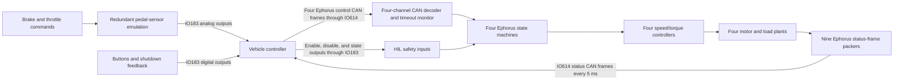

# Inverter HIL Plan

## 1. Status and scope

This file is a planning document only. No Simulink model, Speedgoat application,
or generated code is part of this phase.

The vehicle controller (VCU) is the device under test. The Speedgoat system will
replace the complete four-channel Electrophorus Ephorus3 unit and four basic
motor/load plants. The closed-loop signal path will be:



Brake and throttle do not directly command the inverter plant. They are sent to
the VCU as analog pedal signals. The VCU must process them and issue the Ephorus
CAN torque/speed command. This preserves the real controller path and allows the
HIL to test pedal plausibility, brake-over-throttle behavior, torque arbitration,
and CAN command generation.

## 2. Source basis

The allocation and behavior in this plan were derived from:

- `C:\Users\aniru\Downloads\Schematic PDF_[No Variations].pdf`, page 1, VC Interface.
- `C:\Users\aniru\OneDrive - McGill University\mfe\data_sheets\Ephorus3 Datasheet and Handling Guidelines v1.03 (1).pdf`, especially pages 12-13, 26-30, and 42-43.
- The supplied IO183 Connector A and Connector B pinout images.
- The installed Speedgoat IO183 and IO614 documentation in this workspace.
- [McGillFormulaElectric/MFE26-VC `todo` branch](https://github.com/McGillFormulaElectric/MFE26-VC/tree/todo), at commit
  `39ea8efd3fc4e88f76e876f94fb99d4adabb7749`, especially `sil/gui/main.cpp`,
  `Core/Src/driverInputs.cpp`, `Core/Src/vcComms.cpp`,
  `Core/Inc/FreeRTOSConfig.h`, `Drivers/Device_Drivers/Inc/ephorus_driver.hpp`,
  `Drivers/Device_Drivers/Src/ephorus_driver.cpp`, and
  `sil/registry/profiles/ephorus.md`.
- MathWorks Simulink Real-Time documentation for tunable parameters,
  `slrealtime.Target.setparam/getparam`, real-time instruments, and App Designer
  target controls.

Direction convention used below:

- `HIL -> VCU`: Speedgoat drives a vehicle-controller input.
- `VCU -> HIL`: Speedgoat measures a vehicle-controller output.
- `HIL <-> VCU`: bidirectional CAN traffic.

## 3. Proposed hardware allocation

### 3.1 IO183 Connector A: analog signals

Configure all four analog outputs for 0-5 V and use simultaneous output update.
The four outputs exactly cover the two redundant throttle and two redundant
brake channels shown in the schematic.

| IO183 pin | IO183 channel | Direction | Schematic net | VCU pin | Test-board point | Purpose |
|---|---|---|---|---:|---|---|
| A1 | Analog Output 01 | HIL -> VCU | `ANA_THROTTLE_1` | 46 | J2 pin 21 | Throttle sensor channel 1 |
| A2 | Analog Output 02 | HIL -> VCU | `ANA_THROTTLE_2` | 48 | J2 pin 19 | Throttle sensor channel 2 |
| A3 | Analog Output 03 | HIL -> VCU | `ANA_BRAKE_P_1` | 53 | J2 pin 23 | Brake-pressure sensor channel 1 |
| A4 | Analog Output 04 | HIL -> VCU | `ANA_BRAKE_P_2` | 50 | J2 pin 17 | Brake-pressure sensor channel 2 |
| A5 | Analog Ground | Reference | Sensor ground | - | Harness ground | Primary analog reference |
| A6 | Analog Ground | Spare reference | Sensor ground | - | Harness ground | Spare analog reference |
| A7 | Analog Input 01 | VCU -> HIL | `5V_THROTTLE_1` | 88 | Harness tap required | Monitor throttle-1 sensor rail |
| A8 | Analog Input 02 | VCU -> HIL | `5V_THROTTLE_2` | 86 | Harness tap required | Monitor throttle-2 sensor rail |
| A9 | Analog Input 03 | VCU -> HIL | `5V_BP_1` | 84 | Harness tap required | Monitor brake-1 sensor rail |
| A10 | Analog Input 04 | VCU -> HIL | `5V_BP_2` | 82 | Harness tap required | Monitor brake-2 sensor rail |
| A11-A14 | Analog Inputs 05-08 | Not used in single-ended baseline | Reserved for differential rail returns | - | Harness tap required | Preserve four-channel differential option |
| A15 | 0 V | Not used in baseline | Target-machine 0 V | - | - | Use only if required by an externally powered interface |
| A16 | +5 V | Not used in baseline | Target-machine +5 V | - | - | Do not use as a pedal supply without a current/ground review |
| A17 | Analog Ground | Spare reference | Sensor ground | - | Harness ground | Spare analog reference |

The baseline configures AI01-AI04 for single-ended 0-5 V rail monitoring after
the harness-tap and ground strategy are approved. In differential mode, however,
A7-A14 become four fixed pin pairs; the A7-A10 single-ended assignment consumes
the pins that form differential channels 1 and 2. Preserve the alternative
allocation below until the ground-offset measurement establishes which mode to
use:

| VCU rail | Single-ended baseline | Differential channel | Differential pins |
|---|---|---|---|
| `5V_THROTTLE_1` | A7 / AI01 | AI01 | A8 (+), A7 (-) |
| `5V_THROTTLE_2` | A8 / AI02 | AI02 | A10 (+), A9 (-) |
| `5V_BP_1` | A9 / AI03 | AI03 | A12 (+), A11 (-) |
| `5V_BP_2` | A10 / AI04 | AI04 | A14 (+), A13 (-) |

Build each rail tap with two conductors, one rail signal and one local sensor
return, even if the baseline initially terminates the returns at the common
IO183 analog ground. Do not allocate A11-A14 to unrelated signals until the
single-ended-versus-differential decision is closed. These measurements permit
later ratiometric pedal emulation without rebuilding the harness.

All four IO183 analog outputs are consumed by the redundant brake/throttle
channels. J2 also exposes `ANA_IN_4`, `ANA_IN_1`, `ANA_IN_3`, and `ANA_IN_2` on
pins 25, 27, 29, and 31, but stimulating any of them requires a second analog
output module or external programmable source.

Pedal conversion will be parameterized rather than hard-coded:

```text
V_channel = V_released + command_0_to_1 * (V_pressed - V_released)
```

Each channel will have its own released voltage, pressed voltage, slope, clamp,
and fault override. The actual values and whether the redundant channels are
parallel, inverse, or ratio-matched must be taken from the VCU calibration or
measured on the real sensors. Typical pedal values must not be assumed.

The IO183 hardware initial and reset values will be 0 V. Based on the current
firmware's raw-count windows, a stopped, failed, or unloaded application is
intended to present an out-of-range pedal fault rather than a healthy-looking
pedal value; this remains a measured acceptance test, not an unchecked hardware
assumption. After the target application is running, its IO status is healthy,
and an operator or automated scenario has armed the pedal interface, the model
will slew all four channels to their calibrated released-pedal voltages. Loss of
the model heartbeat returns the channels to 0 V through the configured
reset/fallback path.

The VCU has separate sensor rails on pins 88/86 for throttle and pins 84/82 for
brake; those rails are not present on J2 or J3. The current `todo` firmware uses
fixed ADC-count calibration, explicit lower and upper raw-count windows, and
channel-agreement checks rather than explicitly measuring those rails. Its
lower-bound checks make a 0 V stimulus invalid for both throttle channels and
brake channel 1; brake channel 2 plausibility is currently disabled, but the
remaining invalid channels still make the aggregate input invalid. The target
test must confirm this behavior before 0 V is accepted as the hardware fallback.
Each calibration point must also be measured at the connected VCU pin under
load, not only at the IO183 connector.

### 3.2 IO183 Connector B: digital signals

The allocation groups HIL-driven VCU inputs on channels 1-8 and VCU outputs on
channels 9-13. Channels 5-8 are optional operator switches; channels 14-16 stay
reserved in the baseline.

| IO183 pin/channel | IO183 direction | Schematic net | VCU pin/function | Test-board point | Baseline use |
|---|---|---|---|---|---|
| B1 / DIO01 | Output, HIL -> VCU | `PRECH_BTN_IN` | pin 99, `PRECH_BTN_IN` | J2 pin 1 | Precharge-button stimulus |
| B2 / DIO02 | Output, HIL -> VCU | `MAIN_BTN_IN` | pin 101, `MAN_BTN_IN` | J2 pin 3 | Main-button stimulus |
| B3 / DIO03 | Output, HIL -> VCU | `COOLING_SW_IN` | pin 103, `COAST_IN` | J2 pin 5 | Cooling/coast switch stimulus; polarity TBD |
| B4 / DIO04 | Output, HIL -> VCU | `SD_FB_IN` | pin 113, `SD_FB_IN` | J2 pin 15 | Shutdown-loop feedback stimulus |
| B5 / DIO05 | Output, HIL -> VCU | `SW_IN_1` | pin 111, `SW_IN_1` | J2 pin 13 | Optional switch stimulus |
| B6 / DIO06 | Output, HIL -> VCU | `SW_IN_2` | pin 105, `SW_IN_2` | J2 pin 7 | Optional switch stimulus |
| B7 / DIO07 | Output, HIL -> VCU | `SW_IN_3` | pin 107, `SW_IN_3` | J2 pin 9 | Optional switch stimulus |
| B8 / DIO08 | Output, HIL -> VCU | `SW_IN_4` | pin 109, `SW_IN_4` | J2 pin 11 | Optional switch stimulus |
| B9 / DIO09 | Input, VCU -> HIL | `VC_SD_OUT` | pin 25, `VC_SD_OUT` | TP6 | Monitor VCU shutdown output |
| B10 / DIO10 | Input, VCU -> HIL | `MAIN_EN_OUT` | pin 27, `MAIN_EN_OUT` | TP7 | Monitor main-contactor enable request |
| B11 / DIO11 | Input, VCU -> HIL | `PRECH_EN_OUT` | pin 29, `PRECH_EN_OUT` | TP8 | Monitor precharge enable request |
| B12 / DIO12 | Input, VCU -> HIL | `INV_CTRL_DIS` | pin 34, inverter output bank | TP10 | Ephorus Control Disable input to model |
| B13 / DIO13 | Input, VCU -> HIL | `INV_CTRL_EN` | pin 36, inverter output bank | TP9 | Ephorus Control Enable input to model |
| B14 / DIO14 | Reserved | - | Candidate: `GRI_RELAY_1`, pin 35 | TBD | Not connected in baseline |
| B15 / DIO15 | Reserved | - | Candidate: `COMET_RELAY`, pin 37 | TBD | Not connected in baseline |
| B16 / DIO16 | Reserved | - | Candidate: `GRI_RELAY_2`, pin 39 | TBD | Not connected in baseline |
| B17 | Digital Ground | Reference | Controller logic ground | - | Harness ground | Connect only after ground strategy review |

The verified J2 odd-pin order is `PRECH_BTN_IN` 1, `MAIN_BTN_IN` 3,
`COOLING_SW_IN` 5, `SW_IN_2` 7, `SW_IN_3` 9, `SW_IN_4` 11, `SW_IN_1` 13,
`SD_FB_IN` 15, `ANA_BRAKE_P_2` 17, `ANA_THROTTLE_2` 19,
`ANA_THROTTLE_1` 21, and `ANA_BRAKE_P_1` 23. The switch nets are deliberately
not in numeric order on the header.

J2 even pins 2-12 are BMS-side signals: `PRECHARGE_SIG_5V` 2, `HV_ON_SIG` 4,
`CONTACTOR_FB_24V` 6, `CURRENT_IN_5V` 8, `IMD_PWM_12V` 10, and `SD_IN_24V` 12.
They are outside the VCU-only baseline and must remain disconnected unless the
BMS is deliberately added with appropriate IO and level conditioning.

TP6-TP10 each include an existing 5 kohm resistor and LED to ground. Measure the
VCU output high and low levels with that load connected before selecting direct
IO183 input wiring or a level-conditioning circuit.

Initial IO183 digital setup:

- Active outputs: channels 1-8.
- Active inputs: channels 9-13.
- Front-connector input resistors: 22 kohm pull-down unless the verified signal polarity requires otherwise.
- Output initial/reset values: logic 0 for all channels until the active levels are confirmed.
- Proposed sample time: 1 ms.

### 3.3 Mandatory digital-level gate

The IO183 digital lines are TTL inputs/outputs, and the configurable input
pull-up is 3.3 V. The installed documentation does not by itself establish that
the input pins are 5 V tolerant. The controller test-board schematic exposes
selectable 3.3 V, 5 V, 12 V, and 24 V stimuli. Therefore:

- Never connect a 12 V or 24 V signal directly to an IO183 digital pin.
- Treat 5 V as unverified and do not connect it until the IO183 hardware rating
  has been confirmed for this exact module revision.
- Measure or obtain the high/low voltage and source/sink behavior of every VCU
  output assigned to B9-B13.
- Confirm that a 3.3 V TTL output is accepted by every VCU input assigned to
  B1-B8.
- Add a level shifter, transistor driver, optocoupler, or protected divider as
  required. The interface must fail low unless a specific signal requires a
  different safe state.
- Confirm the VCU and Speedgoat ground strategy before connecting B17 or A5.
- Before connecting any Speedgoat channel, verify that J3 is fully unjumpered
  from every J2 net the Speedgoat will drive. J3 can otherwise connect an AO to
  a 5 V potentiometer wiper or expose a TTL DIO line to a 3.3 V, 5 V, 12 V, or
  24 V toggle source.

This check is a hard prerequisite for VCU connection, not a future refinement.

### 3.4 IO614 CAN allocation

Baseline assignment: IO614 CAN channel 1 in High-Speed mode, using physical
Connector B.

| IO614 Connector B pin | Signal | VCU connection |
|---:|---|---|
| 7 | CAN High | `CAN1_P`, VCU pin 119 |
| 2 | CAN Low | `CAN1_N`, VCU pin 117 |
| 3 | CAN ground | CAN/logic reference ground after ground review |

Configuration:

- High-Speed CAN, 1,000 kbit/s.
- Standard 11-bit identifiers.
- Receive all four control messages: `0x186`, `0x196`, `0x1A6`, and `0x1B6`.
- Transmit all eight per-inverter status frames plus general status `0x400`
  every 5 ms.
- Drain the IO614 receive queue in a do-while subsystem at a proposed 1 ms rate.
- Monitor CAN write status, receive overrun, error warning, and bus-off status.
- Keep an independent last-valid-command timestamp, timeout state, and decoder
  result for each inverter.
- Accept the VCU firmware's current sequential command timing: at pinned `todo`
  commit `39ea8efd...`, the active `queueControlAll` path calls `osDelay(1)`
  between inverter 1-4 frames and `configTICK_RATE_HZ` is 1000, producing
  approximately 1 ms inter-frame spacing.

The real Ephorus supplies split CAN termination, but the IO614 has no internal
termination and the test-board schematic shows no 120 ohm CAN resistor. Replacing
the inverter can therefore remove one physical bus terminator. Verify resistance
across CAN High and CAN Low with power off, then install 120 ohm termination at
both physical ends of the HIL bus. Do not add a third terminator. CAN1 is still a
planning assumption and must be confirmed with a VCU CAN trace before model
implementation.

## 4. Ephorus CAN contract

### 4.1 Control frames received from the VCU

The VCU sends one standard-ID, DLC-8, little-endian control frame to each
inverter. The payload layout is identical for all four; only the identifier
changes.

| Ephorus channel | Control CAN ID | HIL model instance |
|---:|---:|---|
| Inverter 1 | `0x186` | `Inverter[1]` |
| Inverter 2 | `0x196` | `Inverter[2]` |
| Inverter 3 | `0x1A6` | `Inverter[3]` |
| Inverter 4 | `0x1B6` | `Inverter[4]` |

| Payload location | Type/scaling | Meaning |
|---|---|---|
| byte 0 bit 0 | Boolean | Enable inverter |
| byte 0 bit 1 | Boolean | Reset error |
| byte 0 bit 2 | Boolean | ASC allowed |
| byte 0 bit 3 | Boolean | Current-control mode; unsupported by this vehicle HIL and handled by the refusal policy below |
| byte 0 bits 4-7 and byte 1 | Reserved | Must be ignored on receive and zero in generated test vectors |
| bytes 2-3 | signed int16, 1 RPM/bit | Speed setpoint |
| bytes 4-5 | signed int16, ambiguous 1/256 or 1/512 Nm/bit | Positive torque limit; scale and result gate are defined below |
| bytes 6-7 | signed int16, ambiguous 1/256 or 1/512 Nm/bit | Negative torque limit; scale and result gate are defined below |

#### 4.1.1 Torque-scale ambiguity and result gate

Ephorus table 6.11 is internally inconsistent. It defines a signed 16-bit field
with a unit of 1/256 Nm/count, which spans approximately -128 to +128 Nm, but it
prints a range of -64 to +63 511/512 Nm, which exactly matches 1/512 Nm/count.
The current VCU `todo` firmware encodes with `1/256 Nm/count`; its SIL inverter
model also uses 1/256 but clamps received counts to approximately +/-64 Nm.
Neither implementation proves what the physical inverter accepts.

The HIL decoder will always expose the raw signed counts and both candidate
engineering values. The scale used by the plant will be a versioned protocol
profile, not a GUI-tunable runtime parameter. A capture of the MFE VCU command
alone is circular because it proves only the VCU's existing 1/256 assumption.
Resolve the inverter interpretation using one of these independent checks:

1. Obtain written clarification from Electrophorus.
2. Configure the physical inverter for CAN setpoints, retain its Ethernet status
   broadcast, establish safe Drive conditions without speed, current, or thermal
   saturation, and send a known raw CAN torque limit. For example, raw `8192`
   means 32 Nm at 1/256 and 16 Nm at 1/512. Compare it with the inverter-1
   Ethernet `float32` torque setpoint in table 6.6 bytes 90-93; repeat with a
   negative count and another inverter channel. This test requires an approved
   HV bench, suitable motor/load or equivalent position source, and the team's
   normal energized-inverter safety procedure.
3. Capture the known raw inbound CAN control frame together with the physical
   inverter's `3X3` torque-setpoint response under conditions where the requested
   limit is active and unsaturated.
4. Confirm the interpreted torque against an independent dynamometer measurement
   over several positive and negative commands.

The table 6.11 footnote that values above the range are limited is compatible
with either scaling and does not resolve the conflict. Avoid disputed endpoints
in the physical test so range limiting cannot mask the result.

Host-only decoder work will run explicit 1/256 and 1/512 profiles against the
same raw frames and compare the resulting behavior. It must not silently default
to the current VCU's 1/256 assumption, because mirroring the DUT could hide the
factor-of-two error the HIL is intended to detect. The unresolved scale blocks
only quantitative conclusions about torque magnitude and dependent acceleration,
current, DC-power, and thermal results. It does not block connected-bench work on
precharge/RTD sequencing, pedal plausibility, CAN timeout handling, hardware
control pins, shutdown response, or status flags when those tests are labeled
scale-independent.

The outbound actual-torque and torque-setpoint fields are signed 12-bit values
at 1/32 Nm/count, giving a range of -64 to +63 31/32 Nm. Matching that status
range makes 1/512 Nm/count more plausible for the inbound 16-bit limits, but it
is supporting evidence only; it does not override the inbound table's explicit
1/256 unit column.

#### 4.1.2 Unsupported current-control-mode policy

Current-control mode is documented only for test-bench operation and must not be
used in the vehicle. The basic HIL will therefore catch a VCU command with byte 0
bit 3 set instead of silently approximating a mode it does not implement:

- Decode and log the complete frame, retain its raw values, and refresh command
  age because the CAN frame itself is syntactically valid.
- Set `unsupported_current_mode`, mark the affected inverter not ready, force its
  normal torque and Id/Iq commands to zero, and refuse Idle-to-Drive.
- If asserted while already in Drive, leave Drive for Idle on the next model
  sample and fail the active scenario visibly.
- Clear the diagnostic after a valid command arrives with current-control mode
  false; normal Drive entry conditions must then be satisfied again.
- Do not report the physical inverter's CAN Error state solely because of this
  bit. Refusing Drive is an intentional HIL policy until real hardware behavior
  is captured or documented.

#### 4.1.3 Decoder retention and channel identity

Each decoder instance will retain its own last valid command, record its own
timestamp, reject wrong-DLC frames, and expose raw and engineering-unit values
for logging. A missing command for one inverter must not make the other three
appear stale or failed.

The HIL must keep the protocol identity as inverter 1-4 until the physical
corner mapping is verified. The `todo` branch explicitly lists the FL/FR/RL/RR
to Ephorus-index mapping as unresolved. The GUI may show a provisional corner
label, but it must always display the canonical inverter number beside it.

### 4.2 Status frames transmitted to the VCU

The HIL will transmit nine DLC-8 frames every 5 ms in the datasheet order:
`0x383`, `0x385`, `0x393`, `0x395`, `0x3A3`, `0x3A5`, `0x3B3`, `0x3B5`,
and `0x400`.

Nine standard-ID, DLC-8 classic CAN frames occupy approximately 1.0-1.2 ms at
1 Mbit/s, depending on bit stuffing. The installed IO614 driver provides a
101-message transmit buffer, so one nine-frame group fits comfortably, but every
CAN Write block must expose and log its queue-write status and the model must
detect backlog across 5 ms cycles. The baseline sends a deterministic ordered
burst. Capture the physical Ephorus frame timestamps before fidelity signoff and
add per-frame offsets if the real unit staggers its nine messages.

| Ephorus channel | 3X3 status | 3X5 status | DC-link pair |
|---:|---:|---:|---|
| Inverter 1 | `0x383` | `0x385` | Pair 1/2 |
| Inverter 2 | `0x393` | `0x395` | Pair 1/2 |
| Inverter 3 | `0x3A3` | `0x3A5` | Pair 3/4 |
| Inverter 4 | `0x3B3` | `0x3B5` | Pair 3/4 |

Every 3X3 frame carries that inverter's state, ready and derating flags,
maximum permitted output current, actual torque, torque setpoint, motor
temperature, and power-switch temperature.

Use signed 1/8 C/count for motor temperature. Table 6.13 marks this field with a
leading +/- like the other signed quantities, while unsigned temperature and
voltage fields have no sign marker. Its printed -100 C to +155 C range has no
fractional full-scale endpoint and is therefore treated as the usable sensor
window inside the wider signed 12-bit representation. An unsigned 1/16 C/count
value with a -100 C offset happens to approximate the endpoints, but neither
that offset nor that encoding is documented. Retain the raw 12-bit count and
verify signed 1/8 against a physical status frame at a known temperature; this
capture is required evidence but is not a blocking protocol-profile choice.
The neighboring 16-bit switching-frequency row likewise prints a physical
0-100 kHz window at 1/512 kHz/count instead of the encoded full-scale endpoint,
which independently supports this interpretation of the temperature range.

Every 3X5 frame carries that inverter's Id setpoint/actual, Iq setpoint/actual,
and actual motor speed.

General status ID `0x400` carries:

- DC-link voltage for inverter pair 1/2.
- DC-link voltage for inverter pair 3/4.
- Switching frequency.
- Independent DC-link-above-minimum flags for both pairs.
- Mirrors of Control Enable and Control Disable.

Use 1/64 V/count for both DC-link fields. Table 6.13 assigns all 16 bits to each
field, and 65535 counts at 1/64 V/count reaches 1023 63/64 V, matching the
printed integer endpoint of 1023. The alternative 1/16 V/count reaches
4095 15/16 V and matches the printed endpoint only by discarding two stated
bits. The isolated `15/16` fraction is treated as a table copy error for
`63/64`. Retain raw counts and verify 1/64 against a known-voltage physical CAN
capture, but do not block the protocol profile on this fraction typo.

All frames will use the exact bit positions and only the verified scalings from
Ephorus tables 6.11-6.13. Packing and unpacking will use integer and bitwise
operations, with saturation before conversion. A hand-built known-vector test
will be required for every frame because several status fields cross byte
boundaries. Tests must also prove that status from one inverter never leaks into
another inverter's ID.

## 5. Basic inverter and motor model

### 5.1 Model inputs

Each of the four inverter instances receives only inputs that the corresponding
physical Ephorus channel would receive:

- Its own decoded CAN enable, reset, ASC, speed setpoint, and positive/negative
  torque limits.
- Shared `INV_CTRL_EN` from IO183 DIO13.
- Shared `INV_CTRL_DIS` from IO183 DIO12.
- The applicable pairwise DC-link voltage: pair 1/2 or pair 3/4.
- Per-inverter connected/configured flags, load, and fault-injection controls.

Brake and throttle remain test-input signals to the VCU pedal interface. They
must not bypass the VCU by feeding the inverter torque command directly.

### 5.2 State machines

Four independent state-machine instances will reproduce the four externally
reported Ephorus states:

1. `Idle`: no active error and drive conditions are not all satisfied.
2. `Drive`: CAN enable is true, Control Enable is high, Control Disable is low,
   DC-link voltage is above the configured minimum, and the virtual inverter is
   configured as connected.
3. `Error`: an active or latched operational fault is present.
4. `Config Error`: a mandatory virtual configuration parameter is invalid. This
   state has no soft-reset path and clears only when the virtual inverter is
   power cycled with valid configuration.

The mandatory Config Error checks cover motor pole-pair count, configured motor
rotation direction, and encoder reference calibration values only when the
selected encoder is not EnDat. The virtual configuration therefore includes an
encoder-interface type or `requires_encoder_reference` flag; an EnDat profile
must not enter Config Error solely because reference calibration values are
absent. Marking an inverter merely `connected = false` blocks readiness and Drive
but does not create Config Error. The datasheet is unclear whether one missing
per-motor value reports Config Error only on that channel or disables all four
channels because they share one configuration file. The model will retain both
per-inverter configuration validity and a unit-wide configuration gate; the
physical inverter or vendor must determine which status behavior becomes the
locked hardware profile.

The two hardware-control pins are common to all four instances, while CAN
command age, reset, readiness, state, torque, temperature, and most injected
faults remain independent per inverter. DC-link faults are pairwise.

Baseline safety timing and fault behavior from datasheet sections 4.1-4.2,
evaluated independently for each inverter:

- Command age greater than 50 ms forces Iq and torque to zero without immediately
  leaving Drive; greater than 500 ms latches Error.
- Position age greater than 350 us latches Error. The basic plant has no encoder
  waveform, so it will model this as an independent position-age timer and fault
  injection hook. A 1 ms task cannot reproduce the 350 us boundary; exact timing
  requires a faster task, while the 1 ms baseline reacts on its first observed
  sample and reports the quantization.
- Control Enable low or Control Disable high for more than 100 us forces Iq and
  torque to zero. The proposed 1 ms task reacts on the first observed sample; a
  faster task is required if exact 100 us timing becomes an acceptance criterion.
- Control Enable low while already in Drive leaves the reported state as Drive
  during the 0-200 ms interval, with Iq and torque forced to zero after 100 us.
  If Control Enable remains low for more than 200 ms, Error latches; retaining
  Drive during that interval keeps the datasheet's Drive-only timer reachable.
  Control Disable high removes normal control. The provisional baseline state
  policy is to leave Drive for Idle on the next model sample without inventing a
  Control Disable Error timer. The datasheet defines torque removal after more
  than 100 us but does not define the reported state transition, so this policy
  remains an explicit capture item in section 10.
- DC-link voltage above 700 V or below -10 V always latches Error. Dropping below
  the configured minimum blocks Idle-to-Drive and, if already in Drive, latches
  Error for both inverters sharing that DC-link pair.
- Any phase current above 120 A, a desaturation trip, motor temperature above its
  configured shutdown value, or power-switch temperature above 145 C latches
  Error.
- Id or Iq differing from its setpoint by more than 10 A continuously for more
  than 50 ms latches Error.
- Injected internal measurement failures for phase current, DC-link voltage, or
  power-switch temperature latch Error.
- Any non-Drive state commands zero normal torque.

Error reset uses the datasheet backoff instead of a single fixed delay:

- The minimum wait after an error cause disappears is 500 us.
- At the proposed 1 ms base rate, the 500 us floor and the next 1 ms backoff step
  both become actionable on the first model sample after 1 ms and are therefore
  indistinguishable. Record that quantization in tests; an exact 500 us floor
  requires a faster task or dedicated timing path.
- Repeated Error occurrences double the current wait up to 100 s.
- The datasheet says the wait is reduced after more than 50 ms outside Error but
  does not define the reduction step; the chosen approximation must be documented
  and tested instead of presented as exact behavior.
- The wait returns immediately to 500 us only when the inverter has remained
  outside Error for at least 50 ms, speed is below 100 RPM, and transmitted CAN
  Enable is false.
- Reset succeeds only when no error cause is active, the wait has elapsed, and a
  reset command is present.

The first basic HIL decodes and logs `ASC allowed` but explicitly excludes physical
ASC current and braking-torque behavior. The bit alone is permission, not a mode
request, and must not change normal Drive behavior. The
`unsupported_asc_entry` diagnostic is raised only when all datasheet entry
conditions are simultaneously true: speed above the configured ASC threshold,
ASC allowed, the normal control-enable condition false with discharge active,
and that motor connected in configuration. At that point normal torque is forced
to zero and the scenario fails visibly instead of silently approximating ASC. A
later ASC model must also implement the temperature, command/position timeout,
gate-supply, and speed exit conditions before ASC tests can be accepted.

Each instance will expose the reason for each state transition so test failures
can be diagnosed without decoding only the two-bit state field.

### 5.3 Torque response

The first version will model four independent torque responses needed by the
VCU without simulating power-semiconductor switching:

1. A configurable proportional or PI speed-error controller calculates requested
   torque from the CAN speed setpoint and measured virtual motor speed, with
   anti-windup at the torque bounds.
2. Its output is saturated between the CAN negative and positive torque limits.
3. With an accelerating speed setpoint far above actual speed, output therefore
   settles at the positive torque limit.
4. With a braking speed setpoint below actual speed, output settles at the
   negative torque limit.
5. A configurable torque slew-rate limit and first-order lag represent current-
   loop and mechanical response.
6. Safety, timeout, derating, and state-machine limits are applied after the
   normal torque command and have final authority.

This follows the datasheet's recommended torque-control usage: acceleration is
requested with a positive torque limit and a high allowable speed setpoint;
braking is requested with a negative torque limit and a lower speed setpoint,
commonly 0 RPM. It reproduces the documented external behavior, not the
proprietary internal Ephorus control-loop dynamics. Controller gains, lag, and
slew rate are HIL calibration parameters and must not be claimed as inverter
identification data.

### 5.4 Mechanical plants

The basic motor/load dynamics will run once for each inverter/motor index `i`:

```text
d(omega[i])/dt = (T_motor[i] - T_load[i] - B[i] * omega[i]) / J_eq[i]
speed_rpm[i] = omega[i] * 60 / (2*pi)
```

Parameters:

- `J_eq[1:4]`: equivalent motor, driveline, and vehicle inertia.
- `B[1:4]`: viscous drag coefficients.
- `T_load[1:4]`: independently configurable road/load torques.
- `T_max_pos[1:4]`, `T_max_neg[1:4]`: model limits in addition to CAN limits.
- `tau_torque[1:4]` and `dT_dt_max[1:4]`: torque lag and slew-rate limits.
- `speed_max[1:4]`: model overspeed thresholds.

For the first implementation, each Id will be 0 below base speed and each Iq
will be estimated from `Iq[i] = T_motor[i] / Kt[i]`. A detailed PMSM dq model, field weakening,
PWM switching, and phase-current dynamics are explicitly out of scope for the
basic model. They can replace this plant later without changing the IO or CAN
contract.

### 5.5 DC, thermal, and derating outputs

The two DC-link voltages can be tunable constants or simple first-order
sources. Mechanical power and approximate DC current will be calculated per
inverter for logging:

Positive DC current means battery discharge during motoring and negative DC
current means battery charging during regeneration:

```text
P_mech[i] = T_motor[i] * omega[i]

if P_mech[i] >= 0:
    P_dc[i] = P_mech[i] / eta_motoring[i]
else:
    P_dc[i] = P_mech[i] * eta_regen[i]

I_dc[i] = P_dc[i] / max(abs(V_dc_pair[i]), V_floor)
```

Motoring and regenerative efficiency will be parameterized separately. Simple
first-order motor and inverter temperatures will support status values and
fault/derating tests for all four channels. Derating one inverter will reduce
only that inverter's allowed current/torque and set only its CAN derating flag.
Power-switch derating is fixed from 90 C to 140 C and power-switch shutdown occurs
above 145 C. Motor-temperature derating and shutdown use verified configuration
values rather than those fixed switch-temperature thresholds.
Detailed battery and thermal networks are not required for the first usable VCU
HIL loop.

## 6. Planned Simulink structure for the next phase

No blocks will be created in this phase. The later model should have these
top-level subsystems:

1. `Test Inputs`: throttle, brake, buttons, switches, load, and fault commands.
2. `Pedal Sensor Emulation`: redundant sensor maps, plausibility controls, and
   the four IO183 analog-output commands.
3. `VCU Digital Interface`: IO183 reads/writes, polarity handling, debounce, and
   safe initialization.
4. `IO614 CAN Interface`: setup, receive-queue drain, decoder, status packers,
   transmit blocks, and CAN diagnostics.
5. `Ephorus Channel 1-4`: four top-model atomic instances containing
   Drive/Idle/Error/Config Error, timeout logic, torque response, motor/load,
   current estimates, and thermal states.
6. `Ephorus System Status`: the two pairwise DC links, shared control pins, and
   general `0x400` packer.
7. `Fault Injection`: CAN dropout, pin faults, DC undervoltage, overtemperature,
   derating, sensor correlation, stuck signals, and per-inverter fault masks.
8. `Measurements and Logging`: raw IO, decoded CAN, states, torque, speed,
   currents, temperatures, timeouts, and fault reasons for all four channels.

Use top-model atomic subsystems or a vectorized subsystem for the four inverter
channels. Do not implement them as four instances of the same referenced model
unless tunability is proven for that configuration; Simulink Real-Time limits
parameter tuning for referenced models used more than once.

Proposed execution rates:

- 1 ms base task: IO183, CAN receive queue, state machine, torque, and plant.
- 5 ms task: all nine Ephorus CAN status transmissions.
- 10 ms or slower task: test sequencing, thermal model, and noncritical logging.

## 7. Runtime parameter and App Designer GUI plan

### 7.1 Stable tunable-parameter contract

The App Designer GUI will change VCU stimuli and plant/fault settings while the
real-time application is running. It will use a named logical parameter contract
rather than reaching into arbitrary block-mask parameters. This keeps the GUI
contract stable when the Simulink diagram is reorganized; whether that contract
is backed by structures or independent scalar parameters depends on the required
Simulink Real-Time preflight below.

Proposed parameter groups:

| Parameter path | Type/range | GUI owner | Purpose |
|---|---|---|---|
| `hil_cmd.pedals.throttle` | double, 0-1 | Throttle slider | Commands both calibrated throttle channels |
| `hil_cmd.pedals.brake` | double, 0-1 | Brake slider | Commands both calibrated brake channels |
| `hil_cmd.digital.main_button` | Boolean | Toggle | Drives `MAIN_BTN_IN` |
| `hil_cmd.digital.cooling_switch` | Boolean | Toggle | Drives `COOLING_SW_IN` |
| `hil_cmd.digital.shutdown_feedback` | Boolean | Toggle | Drives `SD_FB_IN` |
| `hil_cmd.digital.precharge_sequence` | uint32 counter | Momentary button | Model generates a deterministic precharge pulse on counter change |
| `hil_cmd.dc_link12_v` | double, bounded | Numeric field/slider | DC link for inverters 1 and 2 |
| `hil_cmd.dc_link34_v` | double, bounded | Numeric field/slider | DC link for inverters 3 and 4 |
| `hil_cmd.inverter(i).load_nm` | double | Four inverter controls | Independent load torque |
| `hil_cmd.inverter(i).connected` | Boolean | Four inverter controls | Connected/configured behavior |
| `hil_cmd.inverter(i).fault_mask` | uint32 | Fault panel | Per-inverter injected faults |
| `hil_cmd.can.drop_control_mask` | uint8 | Fault panel | Drop selected VCU control IDs after receive |
| `hil_cmd.can.drop_status_mask` | uint16 | Fault panel | Suppress selected HIL status IDs |
| `hil_cmd.gui_heartbeat` | uint32 counter | App timer | Detect loss of the operator GUI |

Calibration and plant parameters will be separate from operator commands:

- `hil_cal.pedals.*`: released/pressed voltages, polarity, clamps, and
  plausibility-fault offsets. Change only while stopped until validated.
- `hil_plant.motor(i).*`: inertia, torque constant, drag, thermal constants,
  limits, and slew rates. Runtime tuning is permitted only in Idle or while the
  application is paused unless a test explicitly allows otherwise.

Protocol constants are versioned build-time data and cannot be changed with
`setparam` while running. Inbound torque retains explicit 1/256 and 1/512
profiles until resolved. DC-link voltage uses 1/64 V/count and motor temperature
uses signed 1/8 C/count while retaining raw counts for verification captures.
The GUI displays the unresolved torque interpretation. The application may be
declared `BENCH READY - TORQUE PROVISIONAL` after electrical and communication
preflight, but it cannot be declared `TORQUE CALIBRATED` or used for quantitative
torque-dependent acceptance until the scale is resolved.

Before the nested paths in this table become an implementation dependency, build
a minimal application for the exact Simulink Real-Time release and prove that
`setparam` can update one field without replacing or disturbing sibling fields.
Exercise two host callbacks writing different fields and verify both values on
target. If single-field struct tuning is unsupported, expose independent scalar
`Simulink.Parameter` objects behind the same logical GUI names. Do not implement
GUI-side read-modify-write of an entire shared structure because concurrent
widgets can overwrite each other's updates.

The model will use `Simulink.Parameter` data and code-generation settings that
preserve the selected structure fields or scalar parameters as observable and
tunable in the MLDATX. The app will discover the parameter contract from the
built application and fail with a clear version mismatch if a required path is
missing.

### 7.2 Runtime update path

The GUI will own a Simulink Real-Time target object and use `setparam` to change
individual logical controls while the target application runs. It will use
`getparam` on connect/reconnect to synchronize widgets with the target. Normal
writes will not use `Force=true`; GUI and model bounds remain active.

Runtime flow:

1. A slider, toggle, numeric field, or command button changes.
2. The callback validates and clamps the engineering-unit value.
3. Rapid slider movement is coalesced to the newest value at a 20-50 ms host
   update rate so the GUI remains responsive without flooding target traffic.
4. The preflight-approved single-field path or independent scalar parameter is
   written with `tg.setparam`; whole-structure read-modify-write is prohibited.
5. The model consumes the new value at its next base-rate step.
6. An observable applied-value signal is streamed back to the GUI and displayed
   beside the requested value.

High-rate observations will use a Simulink Real-Time `Instrument` and callbacks,
not a tight `getsignal` polling loop. Low-rate connection, application status,
and parameter reconciliation can use an App Designer timer. Closing or losing
the GUI must not leave a hazardous command latched: the model will monitor the
heartbeat and return GUI-owned stimuli to safe defaults after a configurable
timeout.

### 7.3 GUI visual and interaction design

The GUI will be a MATLAB App Designer `.mlapp` using Simulink Real-Time target
components and custom `uigridlayout` panels. Its first screen will be the actual
operator dashboard, not a landing page. It will follow the `todo` branch SIL GUI
at commit `39ea8efd...`:

- Dense full-window dark engineering console with square outer layout, compact
  spacing, small panel radii, and no decorative graphics.
- Near-black background (`#090C0E`), dark panel surfaces (`#19232D`), green for
  healthy/active, blue for TX/electrical activity, amber for paused/waiting, red
  for faults, and muted blue-gray secondary text.
- Top toolbar: `MFE26 VC INVERTER HIL`, target name, connection/application
  state, elapsed target time, Connect, Load, Start/Stop, and Reset controls.
- Primary VCU state strip: `LV_ON > PRECHARGING > ENABLE > BUZZING > RTD`, with
  a separate red `ERROR` state and time-in-state.
- `Next Transition` guard panel showing main-button, brake threshold, DC-link
  1/2, DC-link 3/4, and other live transition conditions as pass/fail rows.
- Two-column operator area: Driver Inputs on the left; twin DC-link electrical
  mimic and values on the right.
- Brake and throttle sliders in percent with numeric readback and four applied
  pedal-sensor voltages. Use an interlock toggle before enabling intentional
  sensor-plausibility violations.
- Four compact inverter panels labeled `INV1` through `INV4`, each showing
  provisional corner label, state, ready, command age, torque command/actual,
  speed, Id/Iq, temperatures, derating, and active fault.
- Until the inbound torque scale is physically verified, the CAN view shows raw
  torque counts, both candidate torque values, and a persistent red
  `TORQUE SCALE UNVERIFIED` banner. DC-link and motor-temperature rows show their
  raw counts beside the selected 1/64 V and signed 1/8 C values with a quieter
  `CAPTURE PENDING` status until each known-value check is recorded.
- Output-pin cards for `VC_SD_OUT`, `MAIN_EN_OUT`, `PRECH_EN_OUT`,
  `INV_CTRL_EN`, and `INV_CTRL_DIS`, labeled with TP6, TP7, TP8, TP9, and TP10
  respectively and using ON/OFF text plus color so state is never conveyed by
  color alone.
- Split CAN tables matching the reference: VCU TX/HIL RX on the left and HIL
  TX/VCU RX on the right, with live state, ID/name, decoded signal, value, and
  measured rate. Recently changed payload rows are highlighted.

The overview remains dense and scan-oriented. Additional tabs will hold
`Inverters`, `I/O & CAN`, `Faults & Scenarios`, and `Logging` so advanced
controls do not crowd the primary state-machine workflow.

### 7.4 GUI safety and usability rules

- The app reads target values before enabling controls; stale defaults are not
  pushed automatically on connection.
- Requested and applied values are both visible. A mismatch or failed write is
  shown inline and in the session log.
- Momentary commands are generated on target from a sequence counter, avoiding
  host timing dependence for pulse width.
- Calibration edits, unsafe voltage commands, and multi-inverter fault
  injections require the application to be stopped or an explicit expert-mode
  interlock.
- The GUI records every operator command with host time, target time, old value,
  new value, and result.
- Corner labels remain `UNVERIFIED` until FL/FR/RL/RR mapping is confirmed.
- Loss of the GUI heartbeat, target stop, or application unload returns analog
  outputs to 0 V and digital stimuli to their verified inactive levels. Valid
  released-pedal voltages are applied only by a healthy, armed application.

## 8. Implementation work breakdown and commit policy

Implementation will be split into small, reviewable parts. Commit after each
part passes its focused checks; do not accumulate the full model and GUI into a
single commit. Each commit should contain one coherent behavior and its tests or
documentation.

Vendor questions and physical CAN captures should start immediately but must not
block host-only or scale-independent connected-bench work. Before Part 10 begins,
record a calendar `TORQUE_SCALE_DECISION_DATE` and an owner in the project log.
If neither vendor clarification nor a decisive capture is available by that date,
use 1/512 Nm/count as the provisional bench profile because it exactly matches
the table's range column and aligns with the outbound +/-64 Nm status range. Keep
the red banner visible, log raw counts and the profile ID, and mark every torque-,
acceleration-, current-, DC-power-, or thermal-magnitude result provisional.
Precharge/RTD, pedal plausibility, timeout, hardware-control-pin, shutdown, and
status-flag tests may proceed once their own electrical and communication gates
pass.

Part numbers identify commit-sized work packages; they are not a requirement to
execute every package in numeric order. Use this risk-first sequence:

1. **CAN/model vertical slice:** Parts 1, 10-14, 18, 21-22, 24-26, and 37.
   This proves four command decoders, `0x400` precharge feedback, all inverter
   status frames, torque response, virtual motors, and an IO-disconnected target
   build. The pinned VCU requires valid `0x400` voltages above 350 V in ENABLE,
   BUZZING, and RTD. Its four-channel `3X3` readiness check is currently disabled,
   but `3X3/3X5` remains part of the required Ephorus interface and vertical-slice
   demonstration.
2. **HIL-controlled VCU loop:** Parts 4-9 and 38. Safe fallback, brake/button
   stimulation, throttle stimulation, output monitoring, and physical preflight
   are required before claiming that the VCU reaches RTD and commands a virtual
   motor entirely through the HIL. Part 6 may be deferred until the single-ended
   versus differential rail decision is closed, but its two-conductor harness
   provision is retained from the start.
3. **Behavior hardening:** Parts 15-17, 19-20, 23, 27-28, and 36. Add sub-tick
   policy, reset backoff, all fault/derating behavior, unsupported-mode handling,
   thermal/current outputs, fault injection, observability, and integration tests.
4. **Runtime operator GUI:** Parts 2-3 and 29-35. Prove the exact-release tuning
   API before binding controls, then add the dashboard in small passing commits.
5. **Physical evidence and signoff:** Parts 39-40. Part 40 may record electrical
   and scale-independent bench results while Part 39 is open; quantitative torque
   signoff remains provisional until Part 39 resolves the scale.

| Part | Deliverable | Suggested commit |
|---:|---|---|
| 1 | Project/folder scaffold, model configuration, and data dictionary | `build(hil): scaffold inverter HIL project` |
| 2 | Exact-release `setparam` single-field/scalar tuning spike | `test(slrt): verify atomic parameter tuning` |
| 3 | Logical tunable parameter contract and defaults | `feat(hil): define runtime parameter contract` |
| 4 | Hardware initial/reset values and target-side heartbeat fallback | `feat(hil): add safe IO fallback` |
| 5 | Four-channel pedal calibration maps and host tests | `feat(io183): add pedal sensor maps` |
| 6 | Four VCU sensor-rail analog monitors and harness contract | `feat(io183): monitor VCU sensor rails` |
| 7 | Four IO183 analog outputs with simultaneous update | `feat(io183): drive redundant pedal outputs` |
| 8 | IO183 digital VCU stimuli with verified inactive initialization | `feat(io183): add VCU digital stimuli` |
| 9 | TP6-TP10 IO183 monitoring and polarity diagnostics | `feat(io183): monitor VCU control outputs` |
| 10 | IO614 setup, queue drain, and CAN diagnostics | `feat(io614): add VCU CAN transport` |
| 11 | Raw decoding for all four control IDs with independent ages | `feat(can): decode raw Ephorus commands` |
| 12 | Dual inbound-torque interpretations plus raw DC-link and motor-temperature observability | `feat(can): expose Ephorus torque candidates` |
| 13 | Bit-exact raw decoder and timeout tests | `test(can): verify Ephorus control decoding` |
| 14 | Idle, Drive, Error, and Config Error core transitions | `feat(model): add Ephorus state machine` |
| 15 | Command, position, and control-pin timing behavior | `feat(model): add inverter safety timing` |
| 16 | Reset wait, recurrence backoff, and recovery conditions | `feat(model): add inverter reset backoff` |
| 17 | Electrical, current, tracking, measurement, and thermal faults | `feat(model): add inverter fault causes` |
| 18 | Speed-error PI/P controller, saturation, anti-windup, slew limit, and torque lag | `feat(model): add inverter torque response` |
| 19 | Switch/motor derating and current/torque limiting | `feat(model): add inverter derating` |
| 20 | ASC entry conjunction plus unsupported ASC/current-mode diagnostics | `feat(model): guard unsupported inverter modes` |
| 21 | Instantiate and prove isolation of all four inverter channels | `feat(model): expand Ephorus model to four channels` |
| 22 | Four independent motor/load plants | `feat(model): add four motor load plants` |
| 23 | Four thermal and current-estimation plants | `feat(model): add inverter thermal outputs` |
| 24 | Pack 3X3/3X5 status for all four channels using signed 1/8 C motor temperature | `feat(can): pack eight inverter status frames` |
| 25 | Pack pairwise DC-link/general `0x400` using 1/64 V DC-link scaling | `feat(can): add Ephorus general status` |
| 26 | Bit-exact nine-frame tests, queue-status checks, and cross-channel isolation | `test(can): verify all Ephorus status frames` |
| 27 | Per-channel, shared, and Config Error scope fault injection | `feat(model): add inverter fault injection` |
| 28 | Target observability and instrument signal contract | `feat(hil): expose runtime observations` |
| 29 | App Designer shell, target connection, and `todo`-style dark theme | `feat(gui): scaffold VC HIL dashboard` |
| 30 | Runtime throttle, brake, and digital controls | `feat(gui): add live VCU input controls` |
| 31 | VCU state strip, transition guards, and TP6-TP10 outputs | `feat(gui): add VCU state dashboard` |
| 32 | Four inverter status/control panels | `feat(gui): add quad inverter view` |
| 33 | Raw CAN tables, dual-interpreted torque, capture status, and measured rates | `feat(gui): add CAN traffic monitor` |
| 34 | Fault/scenario controls, heartbeat, and safe fallback | `feat(gui): add fault controls and heartbeat` |
| 35 | Session logging and requested/applied audit trail | `feat(gui): add HIL session logging` |
| 36 | MIL and host API integration tests | `test(hil): cover runtime parameter workflow` |
| 37 | IO-disconnected Speedgoat build and smoke test | `test(hil): verify real-time application build` |
| 38 | Record J3 isolation, output levels, grounds, and conditioning measurements | `docs(hil): record IO preflight measurements` |
| 39 | Resolve inbound torque scaling and close quantitative torque signoff | `docs(can): resolve Ephorus torque scaling` |
| 40 | Connected-bench checklist and measured electrical/non-torque signoff | `docs(hil): record inverter HIL bench verification` |

Commit rules:

- Start implementation on a dedicated `codex/inverter-hil` branch.
- Stage only files belonging to the current part; the existing workspace has
  unrelated generated and deleted files that must remain untouched.
- Run the focused tests and `git diff --check` before every commit.
- Commit each completed part before starting the next part. Do not carry unrelated
  work or a known failing test across a part boundary.
- Keep model behavior, GUI behavior, and generated artifacts in separate commits.
- Do not commit `slprj`, `.slxc`, generated real-time build folders, logs, or
  temporary render/clone files unless the repository policy explicitly requires
  a deployable MLDATX artifact.
- Prefer several small passing commits over a large checkpoint commit. If a part
  grows beyond one reviewable behavior, split it again.

## 9. Verification plan

### 9.1 Before connecting the VCU

- Photograph and verify J3 fully unjumpered from every J2 net assigned to an
  IO183 output.
- Confirm every analog calibration and digital voltage/polarity.
- Verify IO183 analog initial/reset output is 0 V, then verify released, midpoint,
  and pressed commands at the connected VCU pins under load.
- Verify conditioned IO183 digital levels with a DMM or oscilloscope.
- Confirm no IO183 digital pin can be exposed to more than its TTL-level interface permits.
- Measure TP6-TP10 high/low levels with each existing 5 kohm and LED load in
  circuit; record the required conditioning and resulting IO183 voltage.
- Confirm CAN channel, CAN1 wiring, baud rate, termination, and the four-channel
  corner mapping.
- Record the torque-scale decision date and selected profile. If unresolved, use
  the provisional 1/512 profile, retain both interpretations, and keep all
  torque-dependent results labeled provisional. A later physical-inverter test
  must pair a known raw command with `3X3` or Ethernet float32 status rather than
  treating an MFE VCU transmit capture as independent evidence.
- Confirm 1/64 V DC-link and signed 1/8 C motor-temperature decoding using
  known-value `0x400` and `3X3` captures, and record all raw known vectors in the
  repository.
- Validate all four control decoders and all nine status packers using
  hand-calculated payloads.

### 9.2 Bench bring-up sequence

1. With the VCU and test board unpowered, verify J3 is fully unjumpered, inspect
   the harness for shorts, and measure expected CAN resistance.
2. Run the HIL with IO disconnected; confirm analog reset values are 0 V,
   digital outputs are inactive, and the GUI cannot arm against an unhealthy target.
3. Connect IO614 only and verify reception of `0x186`, `0x196`, `0x1A6`, and
   `0x1B6` from the VCU, including their actual inter-frame timing.
4. Transmit fixed Idle status and confirm the VCU accepts all eight per-inverter
   status IDs plus `0x400` at 5 ms.
5. Connect conditioned TP6-TP10 monitoring inputs B9-B13 one at a time and verify
   polarity and loaded voltage.
6. Connect digital stimuli B1-B4 one at a time, with all corresponding J3 jumpers removed.
7. Connect each analog pedal channel separately. Verify 0 V while disarmed, arm
   the target, and confirm a controlled transition to its valid released voltage.
8. Exercise heartbeat loss and target stop; all four analog outputs must return
   to 0 V and digital stimuli to verified inactive states.
9. Close the loop and enable the motor/load dynamics only after all raw IO agrees
   with the schematic and VCU diagnostics.

### 9.3 Functional tests

- Released pedals keep requested and actual torque at zero.
- A disarmed, stopped, or heartbeat-failed target drives 0 V. The current `todo`
  lower-bound raw-count checks must report the aggregate driver input invalid on
  the target rather than accepting a healthy released-pedal reading.
- Throttle sweep produces valid commands and positive torque response on all
  four inverter channels. Until the scale is resolved, assert raw-count and sign
  behavior under both profiles and label absolute torque magnitude provisional.
- Torque-controller tests cover positive and negative speed error, saturation at
  both CAN limits, PI anti-windup recovery, configured torque slew, first-order
  lag, and final-authority overrides from state, timeout, derating, and faults.
- Brake sweep produces four valid negative torque limits and regenerative torque
  responses after regen is implemented in the VCU. Until then, the GUI must show
  the current firmware's zero negative-torque limits without faking regen.
- Simultaneous brake/throttle tests VCU arbitration without direct HIL intervention.
- At pinned `todo` commit `39ea8efd...`, missing or <=350 V pairwise DC-link
  data in `0x400` prevents the VCU from remaining in ENABLE/BUZZING/RTD. Verify
  that dependency explicitly. Also record that missing `3X3` status does not
  currently block RTD because `allInvertersReady()` is disabled, so a future
  firmware change cannot silently alter the HIL startup contract.
- Firmware-regression cases cover behavior verified directly at pinned `todo`
  commit `39ea8efd...` in `Core/Src/driverInputs.cpp`: more than 20% disagreement
  between APPS channels is implausible; brake and throttle both at or above 25%
  latch torque cut; torque remains cut until throttle is at or below 5%. These
  are firmware behavior tests, not a claim of rule compliance.
- Record that the current firmware has the brake-channel cross-check disabled
  because brake sensor 2 is marked faulty; add an expected-failure test so that
  enabling the second-channel check later cannot pass unnoticed.
- Loss of Control Enable or assertion of Control Disable removes torque after the
  datasheet's greater-than-100 us threshold, quantized to the first 1 ms sample
  in the baseline task.
- With Control Enable low from Drive, the model reports Drive through the 200 ms
  fault window, forces torque to zero at the first sample after 100 us, and enters
  Error only after the greater-than-200 ms boundary. A shorter low pulse recovers
  without making the Error timer unreachable.
- A 50 ms command gap removes torque only from the affected inverter; a 500 ms
  gap produces Error only on that inverter. A shared-pin fault affects all four.
- Position age over 350 us faults only the affected inverter; the test records
  first-sample quantization at 1 ms and runs an exact boundary test only when a
  faster task is selected.
- Reset cannot clear an active fault. Repeated cleared faults exercise the 500 us
  minimum, doubling wait, 100 s cap, greater-than-50 ms recovery condition, and
  immediate base-reset conjunction at speed below 100 RPM with CAN Enable false.
  At 1 ms base rate, assert that the 500 us and 1 ms waits both clear on the first
  eligible 1 ms sample and label them indistinguishable; run distinct boundary
  tests only with a faster selected task.
- DC-link undervoltage blocks Drive entry while Idle and latches Error if it
  occurs in Drive. Pair 1/2 affects only inverters 1/2 and pair 3/4 only 3/4;
  both conditions are reflected in `0x400`.
- Boundary tests cover DC-link voltage above 700 V and below -10 V, any phase
  current above 120 A, switch temperature above 145 C, configured motor
  overtemperature, Id/Iq error above 10 A for more than 50 ms, desaturation, and
  all three modeled measurement faults.
- Power-switch derating starts at 90 C, reaches zero permitted output at 140 C,
  and affects only the selected inverter's permitted output and status flag.
- `ASC allowed = true` by itself does not change Drive or torque. The
  `unsupported_asc_entry` diagnostic appears only when speed, control-enable,
  discharge, and connected-state entry conditions are simultaneously satisfied.
- A command with current-control mode set refreshes command age but raises
  `unsupported_current_mode`, forces torque and Id/Iq to zero, refuses Drive,
  and fails the scenario. Clearing the bit removes the diagnostic but still
  requires all normal Drive-entry conditions; this policy must not set the CAN
  Error state solely because bit 3 was asserted.
- Control Disable high removes torque at the modeled greater-than-100 us
  boundary and reports Idle on the next model sample under the provisional
  baseline policy. Keep this expected state separate from the verified timing
  requirement so a future physical capture can change it without weakening the
  torque-removal test.
- Config Error ignores CAN reset and clears only after a modeled power cycle with
  valid mandatory configuration. Until physical behavior is known, tests cover
  both per-inverter and unit-wide Config Error reporting profiles.
- An EnDat configuration remains valid without encoder reference-calibration
  values; a non-EnDat configuration missing required values enters Config Error.
- Known-vector tests retain raw torque, DC-link, and motor-temperature counts and
  verify both inbound torque interpretations, 1/64 V DC-link decoding, and
  signed 1/8 C motor-temperature decoding without discarding raw values.
- Swapping any two status IDs is detected by the cross-channel isolation test.
- A nine-frame status cycle fits the IO614's 101-message transmit buffer, every
  write status succeeds, no backlog accumulates over repeated 5 ms cycles, and
  injected queue failures are visible. Record burst duration and compare physical
  Ephorus frame timestamps before choosing final burst or staggered scheduling.
- CAN bus-off and receive overrun are visible in logging.

## 10. Open decisions and hardware-ready gates

1. Blocking only for quantitative torque-dependent signoff: whether inbound
   torque fields use 1/256 or 1/512 Nm/count. Resolve it with vendor clarification,
   a known raw command paired with the physical inverter's `3X3` response, or the
   Ethernet float32 status method in section 4.1.1. If it remains unresolved at
   `TORQUE_SCALE_DECISION_DATE`, use provisional 1/512 with the banner, profile
   ID, raw counts, and provisional result labels. Scale-independent connected-
   bench work may proceed. Also record non-blocking known-voltage `0x400` and
   known-temperature `3X3` captures to confirm 1/64 V and signed 1/8 C decoding.
2. Pedal channel released/pressed voltages, channel correlation, valid windows,
   and whether the fixed ADC calibration is acceptable across actual VCU sensor
   rail and ground variation. Select single-ended or differential IO183 rail
   measurement after measuring ground offset; build every rail tap with signal
   and local-return conductors so all four differential pairs A7-A14 remain usable.
3. Current firmware APPS/brake behavior versus the applicable 2026 competition
   rules, including the intentionally disabled brake-2 plausibility check.
4. Electrical level, output type, active polarity, and inactive state for every
   digital net in the IO183 table. J2 and TP6-TP10 locations are already resolved;
   only the conditioning/harness implementation remains open.
5. Whether the VCU uses CAN1 in its current firmware and the verified mapping of
   Ephorus inverter 1-4 to FL/FR/RL/RR.
6. Existing CAN termination on the VCU/test board after the split-terminated
   Ephorus is removed.
7. Nominal DC-link voltage and configured minimum threshold; confirm the selected
   1/64 V decoding during the known-voltage capture.
8. Per-corner motor torque constants, inertias, drag/load, torque limits, speed
   limits, and desired positive/negative torque slew rates.
9. Configured motor-temperature derating/shutdown values and ASC speed threshold.
10. Physical Ephorus behavior when current-control mode is requested. Until it is
   documented or captured, retain the deliberate HIL policy of refusing Drive,
   forcing zero torque/current, and raising `unsupported_current_mode` without
   reporting CAN Error solely because bit 3 is set.
11. Whether Control Disable high reports Idle, retains Drive while torque is
   zero, or follows another physical state transition. Immediate Idle is the
   provisional HIL policy; the greater-than-100 us torque-removal requirement is
   independent and remains enforced.
12. Whether Config Error is per inverter or unit-wide on the physical 4x unit.
13. Which motor encoder/interface profiles use EnDat. Encoder reference
   calibration values are a Config Error requirement only for non-EnDat profiles.
14. Whether the physical Ephorus transmits its nine 5 ms status frames as a burst
   or with stable offsets that the HIL should reproduce.
15. Whether exact 100 us hardware-control-pin, 350 us position-timeout, and
   500 us reset-floor timing is required; if so, use a faster task or dedicated
   hardware path instead of the proposed 1 ms reaction.
16. Whether the exact Simulink Real-Time release supports independent field-level
   `setparam` updates. If not, use separately tunable scalar parameters.
17. Exact IO183/IO614 physical revisions, target-computer name,
   MATLAB/Simulink Real-Time release, expected MLDATX deployment policy, and
   whether the GUI must support more than one Speedgoat.
18. Which GUI controls are allowed during Drive versus Idle/stopped operation.

Host-only model and GUI work may proceed with explicit torque candidate profiles,
and scale-independent connected-bench work may proceed after its applicable
electrical, IO, and communication gates pass. The GUI remains visibly
`TORQUE SCALE UNVERIFIED`, and every magnitude-dependent result remains
provisional until item 1 is resolved. DC-link and motor-temperature capture checks
remain visible verification evidence without blocking the profile. No Simulink
artifacts are created as part of this planning phase.
